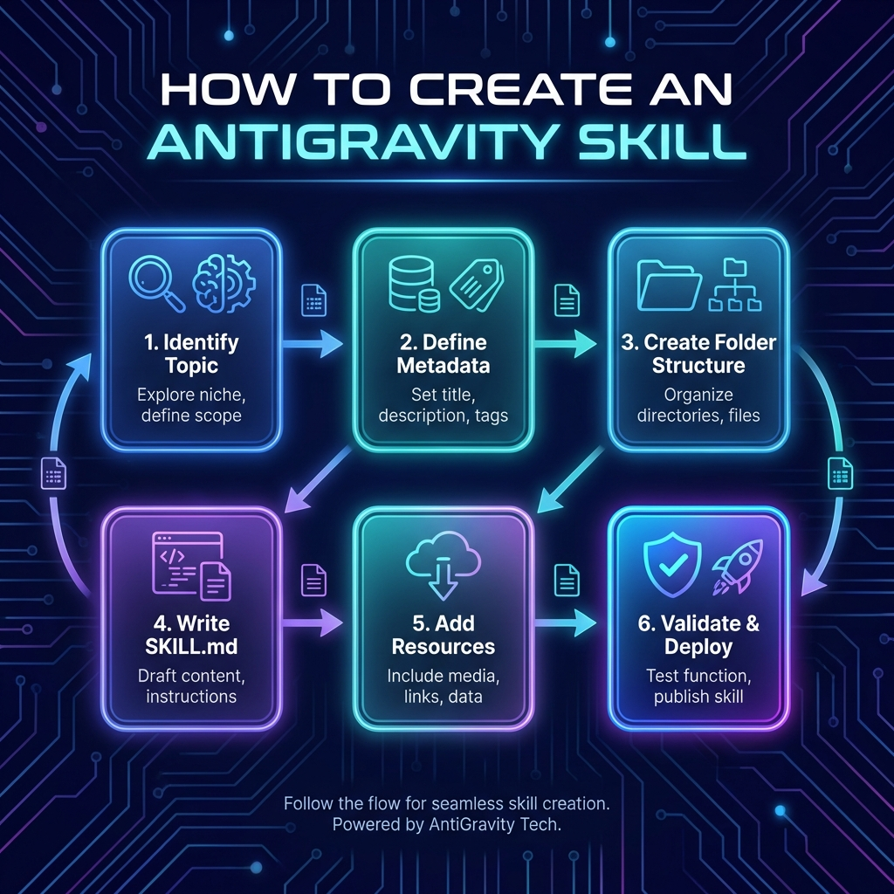

# How to Create an AntiGravity Skill

This guide outlines the process of creating and deploying a new skill for the AntiGravity absolute autonomous agent.

## Skill Creation Workflow

### 1. Identify Need/Topic
*   Explore new niches or user requirements that need specialized agent behavior.
*   Define the scope and guardrails for the skill.

### 2. Define Metadata
*   **Name**: Gerund form, lowercase, hyphens (e.g., `managing-databases`).
*   **Description**: Third-person summary with specific trigger keywords.

### 3. Create Folder Structure
*   Create directory: `.agent/skills/[skill-name]/`
*   Add subfolders: `resources/`, `examples/`, `scripts/`.

### 4. Write SKILL.md
*   Draft the core instructions, trigger rules, and workflow checklists.
*   Ensure paths use forward slashes (`/`).

### 5. Add Resources & Examples
*   Include reference code, templates, or data files to guide the agent.

### 6. Validate & Deploy
*   Test the skill activation.
*   Push to the repository for agent-wide availability.

## Step-by-Step Instructions

1.  **Define Metadata**: Choose a gerund name (e.g., `managing-files`) and write a third-person description.
2.  **Initialize Directory**: Create a folder in `.agent/skills/` with your skill name.
3.  **Craft SKILL.md**:
    *   Include YAML frontmatter with `name` and `description`.
    *   Define "When to use this skill".
    *   Provide a clear "Workflow" checklist.
    *   detail "Instructions" and best practices.
4.  **Add Assets**: Populate the `resources/` folder with templates and the `examples/` folder with reference implementations.
5.  **Verify**: Ensure paths use forward slashes (`/`) and the file is under 500 lines.

## Triggers & Triggers
Skills are activated based on:
- Keywords in the user's prompt.
- Intent patterns detected by the LLM.
- File path or content patterns.

---
*Created by AntiGravity AI*
